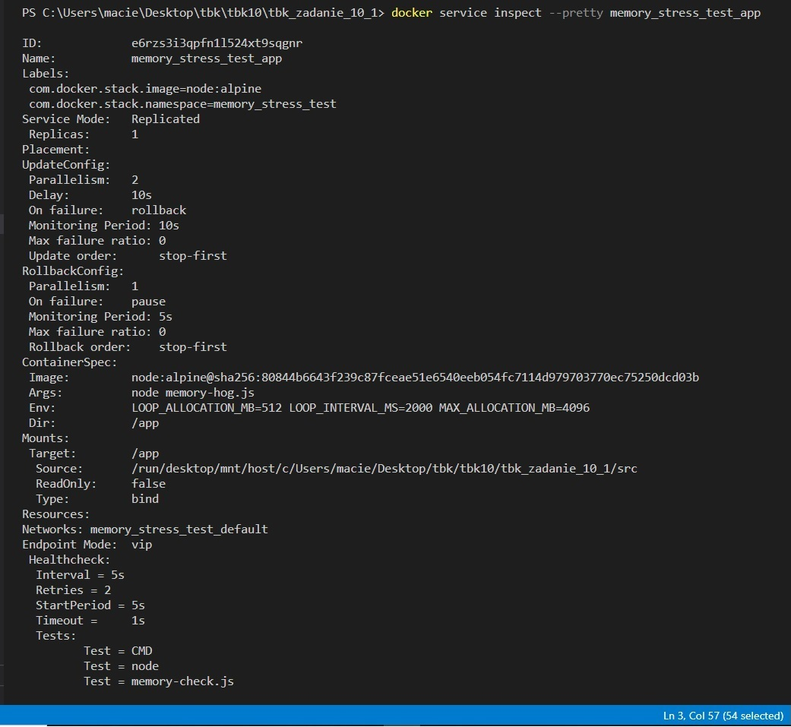

# Instrukcja
W folderze z docker-compose.yml:
```sh
docker swarm init 
docker stack deploy -c docker-compose.yml memory_stress_test 
```
Usuwanie:
```sh
.\clean.ps1  
``` 
# Screenshot
#### Po uruchomienia wewnątrz konsoli kontenera

#### Po osiągnięciu limitu zasobów kontener jest zatrzymywany

#### Inspect
```sh
docker service inspect --pretty memory_stress_test_app
```

#### Widzimy status healthy obecnego kontenera, poprzedni exited
```sh
docker ps -a
```
